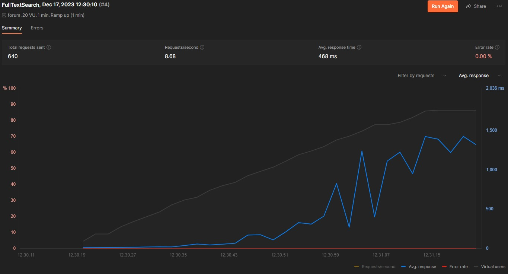

# WebForum
## Contributors
* Nancy Radadia - [nradadia@stevens.edu](nradadia@stevens.edu)
* Parth Panchal - [ppanchal1@stevens.edu](ppanchal1@stevens.edu)

## GitHub URL
[https://github.com/parth-panchal/WebForum](https://github.com/parth-panchal/WebForum)

## Estimated Hours
* Nancy Radadia - 20 hours
* Parth Panchal - 20 hours

## Code Testing
The code testing was done primarily using Postman. Every endpoint was tested using Postman to ensure that the correct data was being returned. Some endpoints, that only had GET calls, were also tested using the web browser.

The variables were setup in Postman to test the endpoints. Some of the variables were setup as follows:
* `id` - the id of the post
* `id2` - the id of the post
* `key` - the key used by either user or post to delete the post
* `fulltext_id` - the id of the newly created post that will be used to test the fulltext search
* `full_text_query` - the query that will be used to test the fulltext search
* `timestamp` - the timestamp of the post

Automated Code runner was used to test the code for any errors. The code was tested for any errors and the errors were fixed. 

Additionally, we have also performed Loadtesting using Postman as you can see in the image below:  

## Unresolved Bugs
* Automated Performance testing: Due to updating values of the variables. The automated testing had a high error rate as the queries were co-inciding with each other.

## Issues Faced
* The First and foremost bug we faced was the API testing failures. As we have used Serializers from Django Rest Framework (DRF), we would often get lists of objects instead of a single object. Hence, we had to change the testing method to get the first object from the list of objects.
* Populating the db while setting up the server was often a hassle. We often had to delete the db and re-run the entire process again. So we made the following management commands populate the db with the data we wanted.
  * `python manage.py popluate_db`
  * `python manage.py create_superuser`
* CORS errors were also a big issue. We had to add the following code to the `settings.py` file to allow CORS requests.
    ```python
    CORS_ORIGIN_ALLOW_ALL = True
    CORS_ALLOW_CREDENTIALS = True
    ```


## Extensions
* Users and User keys

    * `/user` (POST) - Used to create a user. Also returns a special key that can be used to delete the post
    * `/post/{{id}}/delete/invalid_key?user_key={{key}}` (DELETE)- The post can be deleted using the regular key or the user key that can be provided as a query parameter
    * `/post/{{id}}` (GET) - Returns the post with the user details

* User Profiles
  
    * `/user?username={{query}}` (GET) - Returns the user with the username provided in the query parameter


* User-based range queries
    
    * `/post/user?user_id={{id}}` (GET) - Returns all the posts by the user with the id provided in the query parameter

* Fulltext search
    
    * `/post/search?query={{query}}` (GET) - Returns all the posts whose data matches the query provided in the query parameter
  
* Persistence

    * We have used the `db.sqlite3` file to store the data. The data is stored in the database and is persistent. It will not get lost when the server is restarted as it is saved in the filesystem and not in the memory. Run the following command to setup the server and populate the db:
        ```bash
        python manage.py populate_db
        ```
    Note - If there is already data inside the db, the above command will not populate the db.


## Tests
The Tests can be found in the `tests/` directory. The tests are made using Postman. The tests can be run using the following command:
```bash
./test.sh
```
### Collections
The tests are divided into 4 collections:
* `forum- post, read, delete.postman_collection.json`
  
  * Create post
  * Read post
  * Delete post with invalid key
  * Delete post with valid key
  * Read post after deletion 

* `forum- multiple posts.postman_collection.json`
  
  This collection tests the endpoints that are used to create multiple posts and then delete them. The tests are as follows:
  * Read post 1
  * Read post 2
  * Create post 1
  * Read post 1
  * Read post 2
  * Create Post 2
  * Read post 1
  * Read post 2


* `FullTextSearch.postman_collection.json`
    
    * Create Post
    * Search Post with query


* `Users.postman_collection.json`

    * Create User 1
    * Read User 1
    * Create post based on user 1
    * Delete post based on user 1's key
    * Check for deleted post
    * Create post 1 based on user 1
    * Create post 2 based on user 1
    * Get all posts based on user 1

### Persistent Storage
The persistent storage can be tested by accessing the admin dashboard of django. The admin dashboard can be accessed using the following url: [http://localhost:5000/admin/](http://localhost:5000/admin/). The admin dashboard can be used to view the data stored in the database. The data can be viewed in the following tables:
* Posts
* CustomUser

The default credentials for the user are as follows:
* username - `admin`
* password - `admin`

## Shell Scripts
The shell scripts can be found in the `scripts/` directory. The shell scripts are as follows:
* `run.sh` - Used to run the server
    ```bash
    chmod +x run.sh
    ./run.sh
    ```
* `test.sh` - Used to run the tests
    ```bash
    chmod +x test.sh
    ./test.sh
    ```
* `setup.sh` - Used to setup the server and populate the db
    ```bash
    chmod +x setup.sh
    ./setup.sh
    ```